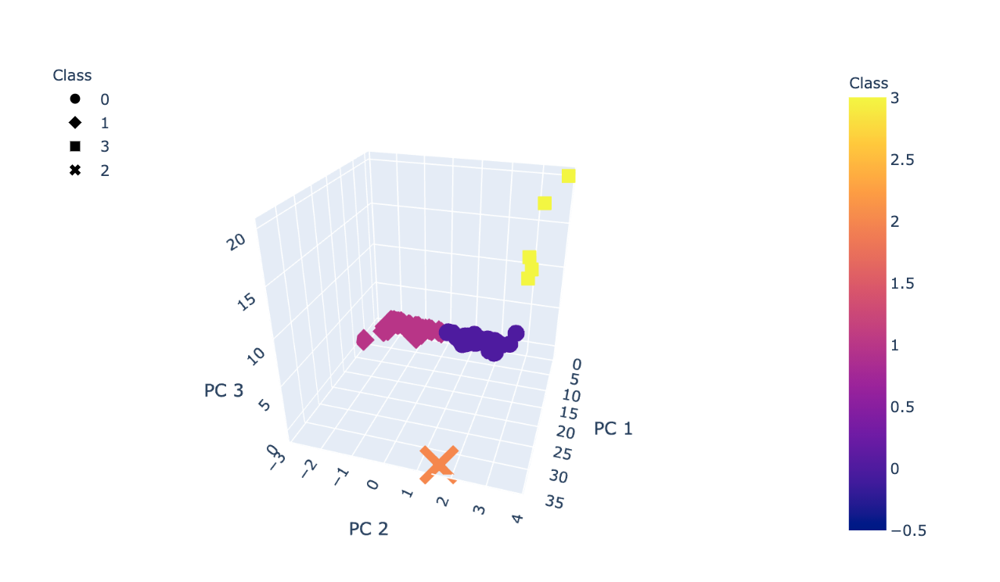

# Cryptocurrencies

## Overview

The main purpose of the challenge is to provide a report for an investment bank that is seeking to offer cryptocurrency investment portfolio. In the report the cryptocurrencies are shown on the trading market, and they are grouped to create a classification system this is done for the new investment. To perform the tasks for this project, I will perform unsupervised machine learning functions on data provided by CryptoCompare.

## Results

I cleaned the data to keep actively traded cryptocurrencies, and that also a defined algorithm, also it must have a complete set of data. With all theses standards set only 532 different cryptocurrencies remained. After that I created a three dimensional graph that represents the groups of the different cryptocurrencies. For each point it has a name and the algorithm used to create the currency.

Then I added a two dimensional graph that represents the relationship between the total coin supply and the total coins mined this was done to compare each currency to the rest, also it is well noted that each point has its currency name.

